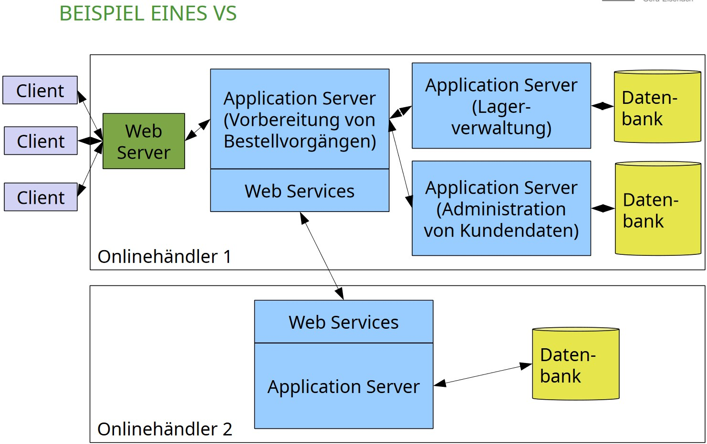
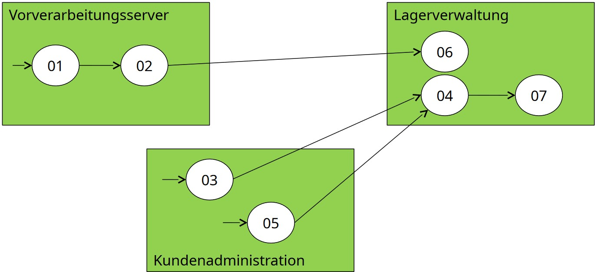
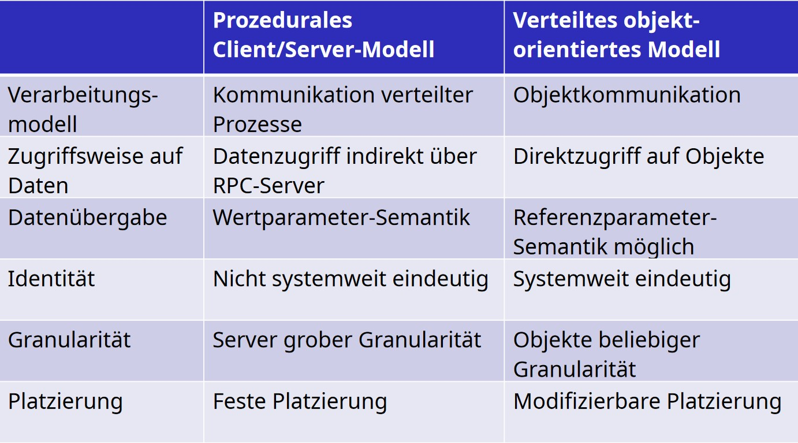
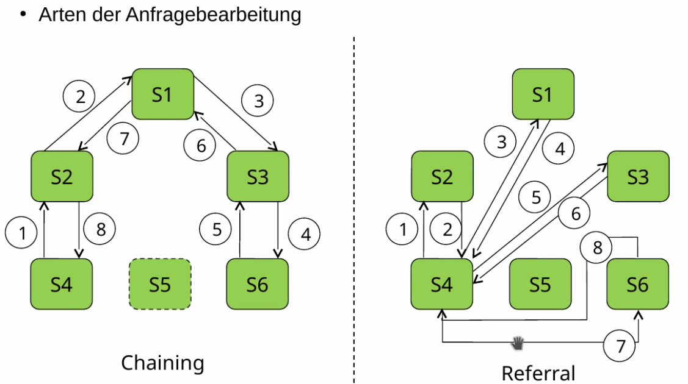
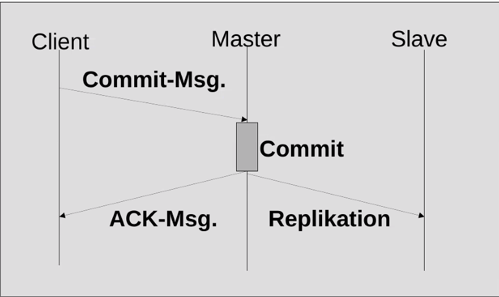
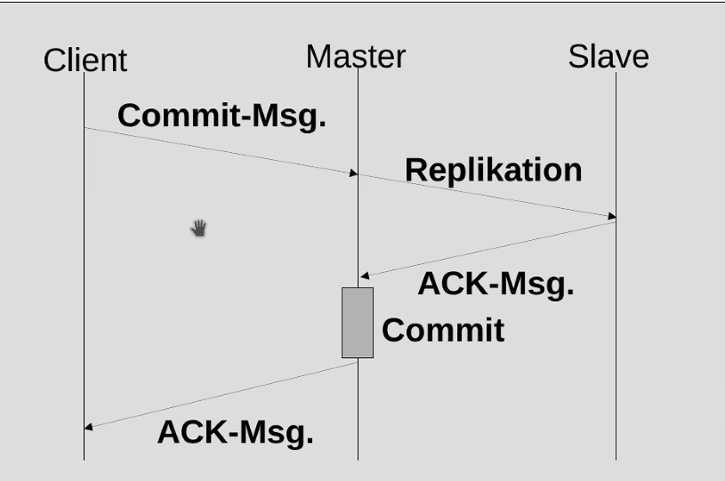
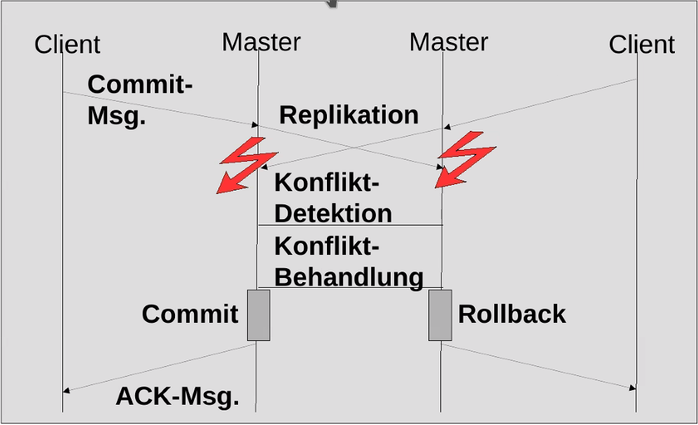
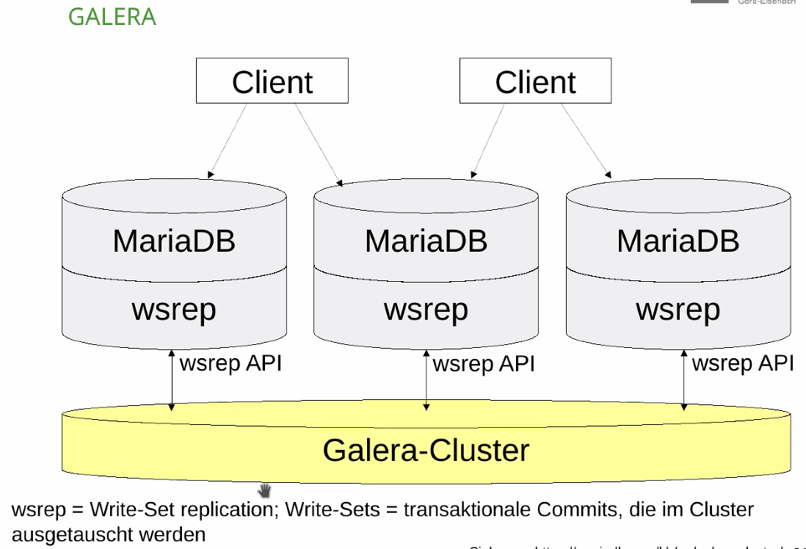
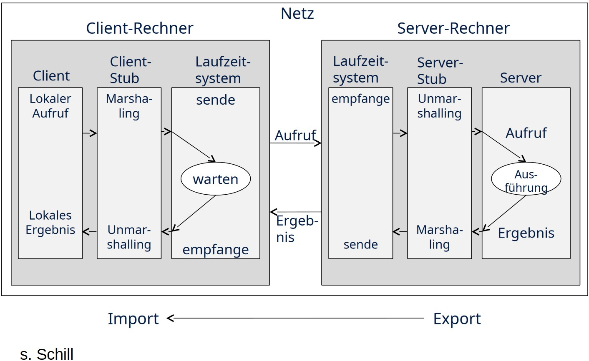

<!----------
title: "Verteilte Systeme"
date: "Semester 6"
keywords: [NET, Verteilte Systeme, verteilt, DHGE, Semester 6]
header-includes:

  - \usepackage{enumitem}
  - \setlistdepth{20}
  - \renewlist{itemize}{itemize}{20}
  - \renewlist{enumerate}{enumerate}{20}
  - \setlist[itemize]{label=$\cdot$}
  - \setlist[itemize,1]{label=\textbullet}
  - \setlist[itemize,2]{label=--}
  - \setlist[itemize,3]{label=*}

---------->

Verteilte Systeme
===========================================

<!-- md2apkg ignore-card -->

<!-- START doctoc generated TOC please keep comment here to allow auto update -->
<!-- DON'T EDIT THIS SECTION, INSTEAD RE-RUN doctoc TO UPDATE -->
**Inhaltsverzeichnis**

- [Verteilte Systeme](#verteilte-systeme)
- [Prüfungsleistung](#prüfungsleistung)
- [Einleitung und grundlegende Begriffe](#einleitung-und-grundlegende-begriffe)
  - [Definition verteiltes System](#definition-verteiltes-system)
  - [zentrale Zielsetzung verteilter Systeme](#zentrale-zielsetzung-verteilter-systeme)
  - [CAP-Theorem](#cap-theorem)
  - [Basismechanismen verteilter Systeme](#basismechanismen-verteilter-systeme)
  - [Systemarchitekturen und Modelle](#systemarchitekturen-und-modelle)
    - [Mehrstufige Architekturen](#mehrstufige-architekturen)
    - [zentrale Vorteile mehrstufiger Architekturen](#zentrale-vorteile-mehrstufiger-architekturen)
  - [Client-Server-Modell](#client-server-modell)
  - [Objektorientiertes Modell](#objektorientiertes-modell)
  - [Exkurs: Parameterübergabe](#exkurs-parameterübergabe)
  - [Vergleich Client/Server vs. OO-Modell](#vergleich-clientserver-vs-oo-modell)
  - [Komponenten-basiertes Modell](#komponenten-basiertes-modell)
  - [dienstorientiertes Modell](#dienstorientiertes-modell)
  - [P2P-Architektur](#p2p-architektur)
  - [Grid Computing](#grid-computing)
  - [Cloud Computing](#cloud-computing)
    - [Klassifizierung von Clouds](#klassifizierung-von-clouds)
  - [Middleware](#middleware)
- [Verzeichnisdienste, verteilte Transaktionen](#verzeichnisdienste-verteilte-transaktionen)
  - [Grundbegriffe](#grundbegriffe)
  - [hierarchische Realisierung von Namens-/VZ-Diensten](#hierarchische-realisierung-von-namens-vz-diensten)
  - [Optimierungen von Namens-/VZ-Diensten](#optimierungen-von-namens-vz-diensten)
  - [Systembeispiele](#systembeispiele)
    - [X.500 - Namenseinträge](#x500---namenseinträge)
    - [LDAP](#ldap)
  - [ACID vs. BASE](#acid-vs-base)
    - [ACID-Prinzip](#acid-prinzip)
    - [BASE](#base)
  - [Zwei-Phasen-Commit-Protokoll](#zwei-phasen-commit-protokoll)
  - [CAP Theorem](#cap-theorem-1)
  - [asynchrone Replikation](#asynchrone-replikation)
  - [synchrone Replikation](#synchrone-replikation)
  - [synchrone Multi-Master-Replikation](#synchrone-multi-master-replikation)
  - [Galera](#galera)
    - [Galera ausgewählte Szenarien](#galera-ausgewählte-szenarien)
      - [Disaster Recovery](#disaster-recovery)
      - [Rolling Updates](#rolling-updates)
      - [Latenzreduktion](#latenzreduktion)
      - [Galera Konsistenzsicherung](#galera-konsistenzsicherung)
- [Kommunikationsparadigmen und -mechanismen](#kommunikationsparadigmen-und--mechanismen)
  - [Allgemeines](#allgemeines)
  - [Sockets](#sockets)
  - [Remote Procedure Call (RPC)](#remote-procedure-call-rpc)
    - [Stubs](#stubs)
    - [Ablauf](#ablauf)
  - [Remote Method Invocation](#remote-method-invocation)
  - [mobiler Code / mobile Objekte](#mobiler-code--mobile-objekte)
  - [Web Services](#web-services)
    - [REST](#rest)
  - [Message Oriented Middleware / Message Queues](#message-oriented-middleware--message-queues)
- [Sicherheitsdienste und -mechanismen](#sicherheitsdienste-und--mechanismen)
  - [Kategorien von Angriffsszenarien](#kategorien-von-angriffsszenarien)
  - [Schutzziele](#schutzziele)
  - [Verschlüsselung](#verschlüsselung)
    - [Verschlüsselung - Vergleich der Verfahren](#verschlüsselung---vergleich-der-verfahren)
  - [Digitale Signaturen](#digitale-signaturen)
  - [Zugriffskontrolle](#zugriffskontrolle)
  - [Anonymisierung](#anonymisierung)
- [Cloud Computing, IaaS, OpenStack, Docker, Kubernetes](#cloud-computing-iaas-openstack-docker-kubernetes)

<!-- END doctoc generated TOC please keep comment here to allow auto update -->
<!--NET hier, aber haben Sie schon mal eine Firma gegründet?-->

Haupt-Editoren für dieses Dokument: ZeroPointMax, RvNovae

<!--newpage-->

<!--Keywords aus dem Chat

- ACID
- REST
- Erlang
- JBOSS
- J2EE
- https://gitlab.com/rak-n-rok/krake
- Lambda-Kalkül
- secustack.com
- heroku.com
- OpenShift
- OpenStack
- MariaDB (auf Konsistenz optimiert)
- MongoDB (auf Verfügbarkeit optimiert)
- Gaia-X - https://gaia-x.eu/news/events/gaia-x-hackathon-3
- Content Distribution Networks
- Paxos (-Protokoll)
- Consensus-Protokolle
- Edge-Cloud

-->

# Prüfungsleistung

- Klausurersatzleistung
- Praktischer Teil: Kubernetes Cluster in 4er-Gruppen aufbauen, Zeitraum zwei Wochen
- Theoretischer Teil: Ausarbeitung zu Fragestellungen, ca. 5 Seiten
  - siehe Markdown-Kommentare

# Einleitung und grundlegende Begriffe

## Definition verteiltes System

<!--prüfungsrelevant-->

Ein verteiltes System ist ein System bestehend aus...

- mehreren Einzelkomponenten
- auf unterschiedlichen Rechnern
- kein gemeinsamen Speicher
- Kooperation mittels Nachrichtenaustausch (Netzwerk)
- gemeinsames Ziel

<!--width=600px-->

## zentrale Zielsetzung verteilter Systeme

- Kooperation und Integration von Funktionalität und Daten über Rechnergrenzen hinweg
- gemeinsamer Ressourcenzugriff
- Parallelisierung
- Skalierbarkeit
- Fehlertoleranz, Ausfallsicherheit, Verfügbarkeit

## CAP-Theorem

Ein verteiltes System kann zwei der folgenden Eigenschaften gleichzeitig erfüllen, jedoch nicht alle drei:

- **C**onsistency (Konsistenz)
- **A**vailability (Verfügbarkeit)
- **P**artition Tolerance (Ausfalltoleranz)

## Basismechanismen verteilter Systeme

- dynamisches Binden: über einen Verzeichnisdienst werden Ressourcen dynamisch gefunden und bei Bedarf eine Verbindung hergestellt
- Transparenz: Interaktion mit verteilten Systemen ist nicht unterscheidbar von Interaktion mit lokalem System

## Systemarchitekturen und Modelle

- mehrstufige Architekturen: *"divide et impera"*
- aufeinander aufbauende Modelle:
  - Client/Server Modell
  - objektorientiertes Modell
  - komponentenbasiertes Modell
  - dienstorientiertes Modell
- P2P-Architektur
- Grid Computing, Cloud Computing

### Mehrstufige Architekturen

- Einteilung von Funktionalität in Stufen (Schichten)
- Stufen werden verteilt und kommunizieren mit **klar definierten Schnittstellen**
- weit verbreitet sind:
  - zweistufige Architekturen, z.B. Client-Server-Modell
  - dreistufige Architekturen, z.B.:
    - Präsentationsschicht - User Interface
    - Verarbeitungsschicht - Applikationslogik
    - Persistenzschicht - Datenbank
- klare Trennung in der Praxis schwierig

### zentrale Vorteile mehrstufiger Architekturen

- Definition eindeutiger Schnittstellen
- unabhängige Modifikationen an den Stufen möglich
- Komplexität des Gesamtsystems wird durch Aufteilung reduziert

## Client-Server-Modell

- Grundprinzip: Clientanwendung ruft über ein Rechnernetz (*enger Kanal*) eine Server-Anwendung auf, die eine Funktionalität zur Verfügung stellt
- Beispiel: Remote Procedure Call
- Rollenverteilung abhängig von Kommunikationspartnern

## Objektorientiertes Modell

- ähnlich zum Client-Server-Modell
- Einsatz von Objekten beliebiger Granularität

<!--width=600px-->

## Exkurs: Parameterübergabe

- vgl. "Call-by-value", "Call-by-Reference"
- Wertparametersemantik
  - Kommunikationspartner sendet Werte, die in lokalen Adressraum kopiert werden
  - Inkonsistenzen möglich
- Referenzparametrik
  - Kommunikationspartner erhält Referenz auf entfernten Wert

## Vergleich Client/Server vs. OO-Modell

<!--width=600px-->

## Komponenten-basiertes Modell

- Erweiterung des OO-Modells
- Komponenten kapseln Funktionalität und werden beim **Deployment** parametriert
- **Komponenten-Container** dienen als Laufzeitumgebung und interpretieren Parameter
- sind für sich leicht installierbar, meist mit **einfachen, klar definierten APIs** und Entwicklungswerkzeugen
- Schnittstellen sollten wohl überlegt sein
- Komponenten sollten so entworfen werden, dass hoher Kommunikations-Overhead zwischen Komponenten vermieden wird

## dienstorientiertes Modell

- Dienste sind durch Schnittstellen definiert
- prozessorientierte Sicht auf ein System, abstrahiert von Implementierung
- Schlagwort *Service Oriented Architectures* (SOA)
- Dienste sind wiederverwendbar
- hohe Granularität und Schnittstellen stehen im Vordergrund
- Basisdienste können zu höheren Diensten *komponiert* werden

## P2P-Architektur

- keine differenzierten Rollen, Peers sind gleichwertige Teilnehmer
- skalierbar, ausfallsicher
- vollwertige P2P-Architektur dezentralisiert Kommunikation, Management, Konfiguration
- Suchaufwand zum Finden des richtigen Teilnehmers ist logarithmisch, d.h. es wird ein zusätzlicher Suchschritt bei verdoppelter Teilnehmerzahl benötigt
  - siehe QuickSort

## Grid Computing

- Konzept zur Aggregation und gemeinsamer Nutzung von heterogenen, vernetzten Ressourcen
- Ressourcen sind geographisch verteilt und im Besitz verschiedener Instanzen
- Unterschiede zum Cluster Computing:
  - dezentrale Administration
  - Verwendung offener Standards
  - umfassende QoS

## Cloud Computing

- passt Ressourcen-Bereitstellung *ad hoc* an Bedarf an
- Infrastruktur ist aus Nutzersicht wie ein lokales System, abstrahiert von Netzwerk
- Verwendung der Infrastruktur über klar definierte Schnittstellen und Protokolle, innerhalb von Programmen genutzt
- spart in aller Regel keine Kosten
- steigert oft Automatisierung

### Klassifizierung von Clouds

- Infrastruktur (IaaS): virtuelle Rechner, Platten, Netze, usw. werden bereitgestellt, aber **selbst verwaltet**
- Plattform (PaaS): vorkonfigurierte Services wie Datenbanken, die für eine Anwendung benötigt werden; Ausführungsumgebung wird zur Verfügung gestellt und automatisch skaliert
- Anwendung (SaaS): Anwendung wird als Komplettpaket zur Verfügung gestellt
- spezielle Dienste wie Function as a Service

<!-- gerne als Klausurfrage (IaaS,PaaS,SaaS)-->

## Middleware

- abstrahiert Netzwerkumgebung für den Client

# Verzeichnisdienste, verteilte Transaktionen

## Grundbegriffe

- Namensdienst: Grundform, Bilden Namen auf Adressen ab
  - Namen: Standortunabhängige Bezeichnung einer Ressource
  - Adresse / Referenz: eindeutige, physikalische / ortsbezogene Bezeichnung
- Verzeichnisdienst: Finden von Kommunikationspartnern, Ressourcen, Attributen, ...
  - Erweiterung des Namensdienstes

## hierarchische Realisierung von Namens-/VZ-Diensten

- Kontexte sind zur Skalierbarkeit und Effizienz der Interpretation zu versch. organisierten Servern zugeordnet
  - TODO: Screenshot *extrahieren*
- Anfrage-Bearbeitung mit Chaining oder Referral
  - Chaining löst rekursiv auf, Referral iterativ
  - Referral ermöglicht besseres Caching

<!--width=600px-->

## Optimierungen von Namens-/VZ-Diensten

- Caching: Speicherung von Teilen des Namensraums
  - v.a. auf unteren Ebenen
  - vollst. oder teilw. Namen
  - TODO: Vor-/Nachteile
  - **reaktiv**
- Replikation
  - v.a. auf unteren Ebenen
  - höhere Fehlertoleranz
  - **proaktiv**, geplant
- Problem: Aktualität von Einträgen und Gewährleistung von Konsistenz
- siehe auch: DNS, CDN, X.500, LDAP

<!--Anm. Max: er hat sehr auf Caching vs. Repl hingewiesen - klausurrelevant-->

## Systembeispiele

- Domain Name System (DNS): Auflösung von Domainnamen auf IP-Adressen
- X.500: mächtiger, flexibel einsetzbarer standardisierter Verzeichnisdiesnt
- Lightweight Directory Access Protocol (LDAP): Leichtgewichtiges Protokoll, dass Anfragen und Modifikation von Informationen eines Verzeichnisdienstes ermöglicht

### X.500 - Namenseinträge

- Distinguished Name (DN)
  - Zusammengesetzter Name für einzelnen Eintrag
  - Zusammengesetzt aus Relativ Distinguished Name (RDN)
- Relative Distinguished Name (RDN)

### LDAP

- De-Facto-Standard für den Zugriff auf Verzeichnisdienste
- Vereinfachung des X.600 Directory Access Protocol (DAP)
- eingesetzt für Benutzerverwaltung, Adressverwaltung, Authentifizierung

## ACID vs. BASE

- BASE:
  - Optimierungsziel: Verfügbarkeit
  - Konsistenz nicht garantiert
  - letzter Schreibzugriff "gewinnt"
  - skaliert besser
  - einfachere Implementierung
  - aggressiv / optimistisch / best effort
- ACID:
  - Optimierungsziel: Konsistenz
  - Isolation von Zugriffen
  - Commit-basiert, komplexe Implementierung
  - konservativ / pessimistisch

### ACID-Prinzip

> auf Konsistenz ausgelegt

- **Atomicity:** Entweder vollständige oder keine Ausführung
- **Consistency:** nur Übergänge von konsistentem Zustand zu konsistentem Zustand
- **Isolation:** Keine Überlappung von Transaktionen, die sich gegenseitig beeinflussen können
- **Durability:** Nach Abschluss einer Transaktion werden Daten garantiert dauerhaft in einer Datenbank gespeichert

### BASE

> auf Verfügbarkeit ausgelegt $\rightarrow$ einfach skalierbar (best effort, optimistic)

- **Basically Available:** Lese- und Schreiboperationen sind immer verfügbar
  - `write` bei Konflikten nicht unbedingt persistent
  - `read` liefert nicht unbedingt zuletzt gespeicherte (bzw. konsistente) Daten
- **Soft state:** keine Garantie für Konsistenz (nur Wahrscheinlichkeit)
- **Eventual consistency:** nach ausreichender Zeit kann von einem konsistenten Zustand ausgegangen werden

## Zwei-Phasen-Commit-Protokoll

- Protkoll zur Konsistenzwahrung zwischen verteilten Datenbanken
- zwei Rollen: **Koordinator**, **Teilnehmer**
- Annahme: zu speichernde Daten liegen den Teilnehmern vor
- bei Fehlschlag Rollback
- beide Phasen sind Teil *einer* Transaktion

**Phase 1:**

- **Versenden von Kommandos zur temporären Speicherung**
  - Koordinator befiehlt Teilnehmer nicht-persistente Speicherung der Daten
- **Bestätigung**
  - Teilnehmer bestätigen Erfolg (bzw. Fehlermeldung/Timeout), dass Daten (nicht) temporär gesichert wurden

**Phase 2:**

- **Versenden eines "Commits"** durch Koordinator $\rightarrow$ alle temporären Daten müssen persistent gemacht werden
  - Bedingung: Phase 1 erfolgreich
  - Koordinator versendet Commit-Befehl
  - alle Teilnehmer müssen Daten persistent speichern
- **Bestätigung persistenter Speicherung** gegenüber Koordinator
  - Teilnehmer bestätigen Erfolg

- Problem: wenn Commit-Entscheidung stattgefunden hat, aber ein Teilnehmer nicht bestätigt (z.B. Absturz)
  - betroffener Teilnehmer muss konsistenten Zustand anfordern und *nachholen* (nicht verwechseln mit Roll-forward) <!--Prüfungsrelevant!-->
  - **Commit-Entscheidungen werden nie rückgängig gemacht**

## CAP Theorem

> Beschreibt Relation zwischen Konsistenz, Verfügbarkeit und Partitionstoleranz

- immer (bis zu) zwei möglich: CA, CP, AP
  - CA-Systeme nicht realistisch
- Consistency
  - schreiben auf einem Knoten, lesen von einem anderen
  - es wird nichts zurückgegeben, als was gerade geschrieben wurde
- Availability jeder Request wird beantwortet
- Partitionstoleranz
  - Partitionen sind verschiedene, **voneinander getrennte Knoten** eines verteilten Systems
  - Szenario: z.B. Netzwerkausfall
  - bei Partitionierung, d.h. Zusammenbruch der Synchronisierung, zwei Reaktionsmöglichkeiten auf Schreibvorgänge
    - Schreibvorgänge abweisen (Konsistenz wahren)
    - Schreibvorgang später synchronisieren (Verfügbarkeit wahren)
- siehe auch: Consensus-Protokolle

<!--Darstellung CAP Theorem wahrscheinlich klausurrelevant-->

## asynchrone Replikation

<!--width=600px-->

- schnelle Replikation, ACK-Msg wird sofort gesendet
- Verfügbarkeitsoptimiert
- Problem: ACK-Msg wird versandt, Replikation kann dennoch fehlschlagen

## synchrone Replikation

<!--width=600px-->

- Konsistenzoptimiert
- empfindlich gegenüber Latenzen, sonst signifikante Performance-Einbußen
  - daher nicht über große Distanzen geeignet
- ACK-Msg wird erst geschickt, wenn Replikation abgeschlossen

## synchrone Multi-Master-Replikation

<!--width=600px-->

- Erweiterung der sync. Repl.
- oft vorgelagerter Load Balancer
- kein Master-Slave-System, sondern gleichberechtigte Master

## Galera

<!--width=600px-->

- gute Eignung:
  - bei wenigen Schreibvorgängen, da teuer
  - häufige Lesezugriffe
  - keine hauptsächlich lokal relevanten Daten
- schlechte Eignung:
  - viele Schreibzugriff
  - lokal relevante Daten

### Galera ausgewählte Szenarien

#### Disaster Recovery

- problematisch bei nur zwei Sites
- zusätzliche Infrastruktur für Failover benötigt

#### Rolling Updates

- Schritt für Schritt Updates installieren, indem immer nur ein Knoten gestoppt und neu gestartet wird
- Zugriff auf andere Knoten noch möglich
- gestoppter Knoten holt ausstehende Replikation nach

#### Latenzreduktion

Latenz kann abhängig von der Geolokalität durch Load-Balancer optimiert werden, indem Clients den Knoten in physischer Nähe nutzen

#### Galera Konsistenzsicherung

- pessimistisch $\rightarrow$ Konsistenz im Vordergrund
- im Falle einer Partitionierung entstehen mehrere *Komponenten*
- nur eine Komponente kann *primär* sein $\rightarrow$ Quorum-Verfahren
- innerhalb einer Partition müssen >50% absolute Mehrheit vorhanden sein, um ein Quorum zu bilden
- Gewichtung der *Stimmen* auch möglich $\rightarrow$ Arbitratoren

# Kommunikationsparadigmen und -mechanismen

## Allgemeines

- Kommunikation ermöglicht Interoperabilität + Kooperation zwischen Instanzen
- hohe Abstraktion von System und Netzwerk
- **Transparenzbegriff: Systemdetails werden nicht mehr wahrgenommen**
- häufig über Middleware realisiert
- verschiedene Ansätze
  - Sockets
  - RPC
  - Remote Method Invocation (RMI) $\rightarrow$ Java
  - Web-Services
  - Message Oriented Middleware / Message Queues $\rightarrow$ asynchrone Kommunikation

## Sockets

- Software-Schnittstelle für IPC
- Posix-Standard, unter Linux verfügbar
- prinzipiell: Deskriptor auf einen weiteren Socket, auf den der Kommunikationspartner zugreift
- unterstützt reguläre Lese- und Schreib-Operationen
- auch in High-Level-Programmierung verfügbar, z.B. in Java, aber mit weniger Kontrolle

## Remote Procedure Call (RPC)

- **synchrone Übergabe des Kontrollflusses** zwischen zwei Prozessen mit **unterschiedlichen Adressräumen**
  - Client-Prozess blockiert während des Aufrufes
- Alternative zu Sockets
- Client ruft Code beim Server aus, als wäre es lokaler Code
- Server führt Code aus, gibt Client Ergebnis zurück
- relativ **schmaler Kanal** zur Kommunikation $\rightarrow$ kein gemeinsamer Speicher, nicht sehr performant
- Funktionsaufrufe sind transparent
- Schnittstelle der entfernten Funktionalität über *Interface Definition Language (IDL)* beschrieben, *Stub* beim Client vorhanden
- entfernte Instanz kann durch *dynamisches Binden* an Client gebunden werden
  - Server wird dem Client ggf. erst zur Laufzeit mit Verzeichnisdienst bekannt

### Stubs

- Funktionen haben Identifier
- Daten werden serialisiert und deserialisiert
- dienen der Abstrahierung eines Funktionsaufrufes in ein Übertragungsformat
- aus Interface-Beschreibung erzeugt

### Ablauf

- Client führt lokalen Aufruf an Client-Stub aus
- Client-Stub führt Marshalling aus $\rightarrow$ Serialisierung des Aufrufs aus dem internen Format, Namensauflösung von Funktionsnamen etc.
- Client-Stub sendet Daten zur Übertragung an Laufzeitsystem
- Server empfängt und überträgt an Server-Stub
- Server-Stub führt Unmarshalling aus $\rightarrow$ Deserialisierung aus Übertragungsformat in internes Format
- Stub führt Server-Aufruf aus
- Ergebnis wird via Marshalling durch Server-Stub an Client-Stub übertragen
- Client-Stub führt Unmarshalling des Ergebnisses aus und übergibt dem Client

<!--width=600px-->

## Remote Method Invocation

- Anwendung von RPC auf objektorientierte Programmierung
- Kommunikation mit entfernten Objekten
- weit verbreitet: Java RMI
  - Schnittstellenbeschreibung über Java-Interface
  - können dynamisch zur Laufzeit nachgeladen werden
  - Implementierung des Interfaces muss nicht bekannt sein $\rightarrow$ Kommunikation mit unbekannten Klassen

## mobiler Code / mobile Objekte

- traditionell: Kommunikation mit festen Instanzen auf untersch. Rechnern
- Mobile Codesysteme ermöglichen die Migration von Verarbeitungslogik
  - Lastausgleich
  - Aktualität des Codes gewährleisten
  - Programmcode zu Daten migrieren kann einfacher sein als umgekehrt

## Web Services

- Ziel: Programmiersprachen- und Plattform-Unabhängigkeit
- Implementierungen:
  - SOAP
  - "Web Service Description Language" (WSDL)
  - UDDI
  - "W3C-Web-Services"
  - **REST Web Services**
- verwenden HTTP
- Addressierung von Ressourcen über **Uniform Resource Identifier/Locator** URI/URL

### REST

- Protokoll zustandslos $\rightarrow$ Zustände werden in Nachrichten codiert
- soll besonders skalierbar sein, da keine Zustandsinformationen serverseitig verwaltet werden müssen
- Anfragen werden nicht an Prozeduren, sondern an Ressourcen/Dokumente übertragen
- Caching möglich
- Methoden (GET, POST, ...) sind nicht an einen Kontext gebunden ($\rightarrow$ **generisch**), wiederverwendbar für mehrere Ressourcen
- verwendet CRUD-Operationen
- häufig werden Services zu *REST-like* entartet, wenn Server Zustände verwaltet, z.B. durch Cookies

## Message Oriented Middleware / Message Queues

- *MOM* ermöglicht synchrone und asynchrone Kommunikation
- Nachrichtenaustausch über Zwischenkomponente (Message Queue)
- Entkopplung der Kommunikationspartner
- häufig persistent
- FCFS-Prinzip
- typischereweise Publish-Subscriber-Modell
- Sender schreibt in MQ, Empfänger liest daraus

# Sicherheitsdienste und -mechanismen

## Kategorien von Angriffsszenarien

- **Verhindern**
  - Angriff auf die **Verfügbarkeit**
- **Erlangen**
  - Angriffe haben unberechtigten Zugriff auf Informationen
- **Modifizieren**
  - Angriff auf die Daten-**Integrität**, Manipulation einer echten, bereits vorhandenen Nachricht
- **Fälschen**
  - Angriffe bringen regulär nicht vorhandene Nachrichten in das System (Replay-Attacke)

## Schutzziele

- **Vertraulichkeit**
  - unberechtigte Teilnehmer dürfen keine Kenntnisse über schützenswerte Informationen erhalten
- **Integrität**
  - Veränderungen müssen zuverlässig erkannt werden
- **Verfügbarkeit**
  - Nutzbarkeit von Diensten muss zum benötigten Zeitpunkt möglich sein
- **Authentizität**
  - Echtheit einer Nachricht muss überprüfbar sein
- **Anonymität**
  - unberechtigte Dritte dürfen nicht ermitteln können, wer die Kommunikationspartner sind und dass überhaupt kommuniziert wird
  - siehe auch: Steganographie

## Verschlüsselung

<!--hier wirklich nochmal?-->

### Verschlüsselung - Vergleich der Verfahren

- symmetrisch:
  - effizient
  - Schlüsselverteilung problematisch, sicherer Kanal notwendig
- asymmetrisch:
  - langsam
  - Schlüsselverteilung einfach, z.B. in Verzeichnisdienst
- aber: Authentizität des Schlüssel kann ohne weiteres nicht gewährleistet werden $\rightarrow$ Signaturverfahren, PKI

## Digitale Signaturen

- asymmetrische Verfahren werden *umgekehrt* angewandt, Schlüssel tauschen die Rolle
- Prüfsumme einer Nachricht wird mit Private Key verschlüsselt
- Empfänger prüft Prüfsumme mit öffentlichen Schlüssel Korrektheit der Prüfsumme

## Zugriffskontrolle

- zwei Grundlegende Formen:
  - **Access Control List**: Speichern Informationen über Ressourcen, auf die zugegriffen werden darf
  - **Capabilities**: Speichern von Subjekt-Rechten
- TODO: Screenshot (ACL ist die ganze Zeile, Capability ist die ganze Spalte)

## Anonymisierung

- Ziel: keine Dritte Partei kann nicht durch die Kenntnis über eine Kommunikation auf die Kommunikationspartner schließen
- einfache Variante: Pseudonyme
- einfach und wenig effizient: Proxy-Server
- aufwändiger: Mix-System
  - Kommunikation mit und zwischen Relays ist immer verschlüsselt
  - Relays leiten Anfragen und Antworten in veränderter Reihenfolge weiter
  - Ein Angreifer muss alle Relays unter Kontrolle bringen, um zu De-anonymisieren
  - Anonymität innerhalb der Menge der teilnehmenden Clients

# Cloud Computing, IaaS, OpenStack, Docker, Kubernetes
