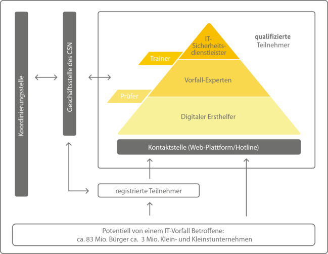

<!----------
title: "Computerforensik"
date: "Semester 6"
keywords: [Computerforensik, Forensik, DHGE, Semester 6]
header-includes:

  - \usepackage{enumitem}
  - \setlistdepth{20}
  - \renewlist{itemize}{itemize}{20}
  - \renewlist{enumerate}{enumerate}{20}
  - \setlist[itemize]{label=$\cdot$}
  - \setlist[itemize,1]{label=\textbullet}
  - \setlist[itemize,2]{label=--}
  - \setlist[itemize,3]{label=*}

---------->

Computerforensik
===========================================

<!-- md2apkg ignore-card -->

<!-- START doctoc generated TOC please keep comment here to allow auto update -->
<!-- DON'T EDIT THIS SECTION, INSTEAD RE-RUN doctoc TO UPDATE -->
**Inhaltsverzeichnis**

- [Organisatorisches](#organisatorisches)
- [Intro](#intro)
- [Digitale Rettungskette / Cyber Security Netzwerk (CSN)](#digitale-rettungskette--cyber-security-netzwerk-csn)
- [häufige Angriffsvektoren](#h%C3%A4ufige-angriffsvektoren)
- [Relevante Gesetze](#relevante-gesetze)
- [Datenschutzvorfälle](#datenschutzvorf%C3%A4lle)
  - [Beispiele für meldepflichtige Datenschutzvorfällen](#beispiele-f%C3%BCr-meldepflichtige-datenschutzvorf%C3%A4llen)
- [Was ist Forensik?](#was-ist-forensik)
- [Was ist digitale Forensik?](#was-ist-digitale-forensik)
  - [Worum geht es bei der Computer Forensik?](#worum-geht-es-bei-der-computer-forensik)
  - [Ziele der forensischen Analyse](#ziele-der-forensischen-analyse)
  - [Arbeitsgebiete der digitalen Forensik](#arbeitsgebiete-der-digitalen-forensik)
  - [Herausforderungen der digitalen Forensik](#herausforderungen-der-digitalen-forensik)
  - [Klassifizierung der Täter](#klassifizierung-der-t%C3%A4ter)
  - [Herausforderungen in der IT-Forensik](#herausforderungen-in-der-it-forensik)
- [Indikatoren für gefährdete Mitarbeiter](#indikatoren-f%C3%BCr-gef%C3%A4hrdete-mitarbeiter)
- [Was sind Spuren?](#was-sind-spuren)
  - [Was sind digitale Spuren?](#was-sind-digitale-spuren)
  - [Was beschreibt das Locard'sche Prinzip?](#was-beschreibt-das-locardsche-prinzip)
- [Primäres und sekundäres Ziel des Vorgehensmodells der digitalen Forensik](#prim%C3%A4res-und-sekund%C3%A4res-ziel-des-vorgehensmodells-der-digitalen-forensik)
- [Ziele der IT-Forensik](#ziele-der-it-forensik)
- [Zwei Varianten der IT-Forensik (auf jeden Fall merken!)](#zwei-varianten-der-it-forensik-auf-jeden-fall-merken)
- [Einordnung digitale Forensik](#einordnung-digitale-forensik)
- [S-A-P-Modell](#s-a-p-modell)
- [Grundlage des Ablaufs einer forensischen Untersuchung (BSI-Leitfaden)](#grundlage-des-ablaufs-einer-forensischen-untersuchung-bsi-leitfaden)
- [Anforderungen an eine neue Methode im forensischen Prozess](#anforderungen-an-eine-neue-methode-im-forensischen-prozess)
- [Forensic Readiness](#forensic-readiness)
  - [Zielsetzung eines Betroffenen](#zielsetzung-eines-betroffenen)
  - [Forensic Readiness: Dimensionen](#forensic-readiness-dimensionen)
  - [Der forensische Arbeitsplatz](#der-forensische-arbeitsplatz)
  - [Forensic Readiness: Transportable Workstations](#forensic-readiness-transportable-workstations)
  - [Forensic Readiness: Schreibschutzadapter](#forensic-readiness-schreibschutzadapter)
  - [Forensic Readiness: Technische Maßnahmen](#forensic-readiness-technische-ma%C3%9Fnahmen)
  - [Forensic Readiness: Organisatorische Maßnahmen](#forensic-readiness-organisatorische-ma%C3%9Fnahmen)
  - [Forensic Readiness: Optionale Maßnahmen](#forensic-readiness-optionale-ma%C3%9Fnahmen)
- [???](#)
- [Datensammlung: Beweisführung im Zivil- oder Strafverfahren](#datensammlung-beweisf%C3%BChrung-im-zivil--oder-strafverfahren)
- [Sicherung besonderer digitaler Beweismittel und Spuren](#sicherung-besonderer-digitaler-beweismittel-und-spuren)
- [Datensammlung: Die wichtigsten Regeln](#datensammlung-die-wichtigsten-regeln)
- [Hashwerte: Einsatzzwecke](#hashwerte-einsatzzwecke)
- [mögliche forensische Untersuchungstechniken](#m%C3%B6gliche-forensische-untersuchungstechniken)
- [Datensammlung Software](#datensammlung-software)
- [Datensammlung](#datensammlung)
- [ISO 27037](#iso-27037)
  - [beteiligte Akteure](#beteiligte-akteure)
  - [DEFR und DES sollten in jedem Fall?](#defr-und-des-sollten-in-jedem-fall)
  - [Grundsätze in der digitale Forensik](#grunds%C3%A4tze-in-der-digitale-forensik)
  - [Grundlegende Aspekte bei der Bearbeitung von digitalen Beweismitteln](#grundlegende-aspekte-bei-der-bearbeitung-von-digitalen-beweismitteln)
  - [Prozess zur Handhabung von digitalen Beweismitteln](#prozess-zur-handhabung-von-digitalen-beweismitteln)
  - [Obhutskette](#obhutskette)
  - [Grundregeln für das Verhalten am Tator](#grundregeln-f%C3%BCr-das-verhalten-am-tator)
  - [Allgemeine Vorkehrungen am Untersuchungsort](#allgemeine-vorkehrungen-am-untersuchungsort)
  - [Personelle Vorkehrungen am Untersuchungsort](#personelle-vorkehrungen-am-untersuchungsort)
  - [potentielle Digitale Beweismittel am Untersuchungsort](#potentielle-digitale-beweismittel-am-untersuchungsort)
  - [Erhebung von nicht digitalen Beweisen](#erhebung-von-nicht-digitalen-beweisen)
- [Tatortfotographie](#tatortfotographie)
- [Dokumentation](#dokumentation)
- [Bekämpfung der Computerkriminalität](#bek%C3%A4mpfung-der-computerkriminalit%C3%A4t)
  - [Incident Handling](#incident-handling)
  - [CERT](#cert)
- [E-Mail-Header-Analyse](#e-mail-header-analyse)
  - [Welche Angaben kann der Angreifer manipulieren?](#welche-angaben-kann-der-angreifer-manipulieren)
- [Betriebssysteme](#betriebssysteme)
  - [Windows](#windows)
    - [wichtige Verzeichnispfade](#wichtige-verzeichnispfade)
    - [Windows Benutzerverwaltung mittels SID](#windows-benutzerverwaltung-mittels-sid)
    - [Windows Registry](#windows-registry)
    - [Windows ShadowCopies](#windows-shadowcopies)
    - [Windows Prefatch Dateien](#windows-prefatch-dateien)
    - [Windows UserAssist Keys](#windows-userassist-keys)
    - [Windows Auslagerungsdateien](#windows-auslagerungsdateien)
    - [Windows ADS](#windows-ads)
  - [MacOS](#macos)
  - [Linux](#linux)
    - [Linux-Dateisysteme](#linux-dateisysteme)
  - [Hacking](#hacking)

<!-- END doctoc generated TOC please keep comment here to allow auto update -->

Haupt-Editoren für dieses Dokument: RvNovae

<!--newpage-->

# Organisatorisches

<!-- md2apkg ignore-card -->

- Prüfung: 40 min (?)
- Schwerpunkte werden zu Beginn der Veranstaltungen wiederholt
- Theorie, Forensik: Datenträger, Demo und Übung auf VMs

<!--newpage-->

# Intro

<!-- md2apkg ignore-card -->

- Digitalisierung ermöglicht neue Schnittstellen, neue Angriffspunkte und Straftaten
- Nutzung MS Teams <!-- LOL --> steigt exponentiell seit 2019 (auch dank Corona)
- Telekom: Angriffe auf HoneyPots stiegen in letzten Jahren erheblich
- bessere Infrastruktur (viele Menschen haben Mittel um anzugreifen)
- Tools zum Erstellen von Schadprogrammen (Script-Kiddies)
- Rentable Form der Kriminalität
- täglich neue Angriffsmuster

# Digitale Rettungskette / Cyber Security Netzwerk (CSN)

<!--width=200px-->

- Meldungen gehen an "Digitalen Ersthelfer"
  - ehrenamtliche Arbeit beim BSI
  - telefonischer first Level Support
  - qualifizierte Einschätzung des Vorfalls
  - dokumentiert Vorgang
- Weiterleitung an Vorfall-Experte / IT-Forensiker
  - meist selbstständig oder Dienstleister
  - Telefonsupport, Vor-Ort-Unterstützung
  - zusätzliche forensische Untersuchungen
- Weiterleitung an IT-Sicherheitsdienstleister

# häufige Angriffsvektoren

- technische Sicherheitslücken
- Social Engineering (Analog/Digital)
  - Phishing-Mails
  - Impersonation
- Diebstahl/Verlust von IT-Geräten

# Relevante Gesetze

- IT-Sicherheitsgesetz
- Datenschutzgrundverordnung
- Bundesdatenschutzgesetz
- Telemediengesetz
- Telekommunikationsgesetz
- Gesetz gegen den unlauteren Wettbewerb
- Urheberrechtsgesetz
- IT-Strafrecht im Strafgesetzbuch

# Datenschutzvorfälle

- liegt ein Datenschutzvorfall vor, besteht eine Meldepflicht (beim BSI) $\rightarrow$ ASAP, es darf keine Verzögerung geben
- kritische Infrastrukturen sind stärker meldepflichtig, als einfache private Unternehmen
- der Vorfall-Experte ist **nicht** für die Meldung verantwortlich!
- die Meldepflicht liegt immer bei der Geschäftungsführung des Unternehmens
- als Vorfall-Experte niemals ohne Zustimmung melden, die Verantwortung liegt bei der Geschäftsleitung!
- Meldepflichten können sich aus gesetzlichen oder vertraglichen Vorgaben sowie freiwillig ergeben
- als KRITIS-Betreiber muss jede **Störung** unverzüglich gemeldet werden
- betroffene Personen sind zu informieren

## Beispiele für meldepflichtige Datenschutzvorfällen

- Cyberangriff führte zum Diebstahl von Kreditkartennummern
- Versand von E-Mail-Werbung trotz bestätigter Löschanfrage
- Verlust eines unverschlüsselten USB-Sticks
- fehlende Transportverschlüsselung bei Online-Registrierungen

# Was ist Forensik?

beschäftigt sich mit der systematischen Untersuchung von kriminellen Handlungen

# Was ist digitale Forensik?

ist die streng methodisch vorgenommene Datenanalyse auf Datenträgern und Computernetzen zur Aufklärung von Vorfällen unter Einbeziehung der Möglichkeiten der strategischen Vorbereitung insbesondere aus der Sicht des Anlagenbetreibers eines IT-Systems [BSI-Leitfaden IT-Forensik, 2011]

## Worum geht es bei der Computer Forensik?

- Nachweis und Ermittlung von Straftaten aus dem Bereich der Computerkriminalität

## Ziele der forensischen Analyse

- Identifikation des Angreifers
- Erkennen der Methode
- Ermittlung der Schadens
- Sicherung der Beweise

## Arbeitsgebiete der digitalen Forensik

- Datenträger-, Multimedia-, Car-, Mobilfunk-, Cloud-, IoT-, Netzwerk-, Memory-Forensik
- Forensische Linguistik
- Überschneidungen zu anderen Gebieten der Informationssicherheit
  - Forensic Intelligence (Predictive Policing, Untersuchung von Radikalisierung im Internet)
  - Informationssicherheitsmanagement
  - Schadsoftware-Analyse / Reverse Engineering
  - Untersuchungen im Darknet
  - Kryptowährungen / Blockchain-Untersuchung

## Herausforderungen der digitalen Forensik

- Massendaten in der Datenträger-Forensik: Datenmengen immer größer, Speicherplatz immer günstiger
- Faktor Zeit: bis zur Entdeckung eines Vorfalls vergehen oft Monate

## Klassifizierung der Täter

nach:

- Fähigkeiten
  - Sicherheitsexperten
  - Exploit-Programmierer
  - Script-Kiddies
- Organisationsformen
  - Alleine
  - Gruppe oder vernetzte Gruppe (Peer Groups)
- Motivationslage
  - Sozial, technisch, politisch, finanziell, staatlich

## Herausforderungen in der IT-Forensik

- die Daten werden mehr, damit die benötigte Zeit (oft Monate)
- hohe Dunkelziffer an Angriffen

# Indikatoren für gefährdete Mitarbeiter

- Unzufriedenheit am Arbeitsplatz
- fehlende Identifikation mit dem Unternehmen
- Auffällige Neugier
- Nutzung von Spionagehilfsmitteln (z.Bsp. Bild- und Tonaufzeichnungsgeräte, mobile Datenträger)
- Auffälligkeiten im persönlichen Umfeld (aufwändiger Lebensstil, Anzeichen für Alkohlsuch etc.)
- Diskrepanzen im beruflichen Werdegang (Über/Unter-Qualifizierung)
- zweifelhafte Dateien/PDF bei der Bewerbung (enthält Malware)

# Was sind Spuren?

- sind materielle Veränderungen an Personen oder Objekten
- stehen im Zusammenhang mit relevanten Ereignissen
- können zur Tataufklärung beitragen, da sie Rückschlüsse auf den Tatablauf und den Täter geben

## Was sind digitale Spuren?

- basieren auf Daten, welche in Computersystemen gespeichert sind oder übertragen wurden
- werden erst durch ihre Interpretation von physischen Spuren über unterschiedliche Interpretationsebenen zu verwertbaren Spuren

## Was beschreibt das Locard'sche Prinzip?

Es gibt keinen Tatort ohne Spuren!

# Primäres und sekundäres Ziel des Vorgehensmodells der digitalen Forensik

- Primär: Aufklärung
  - Sicherstellung be- und entlastenden Beweisen
  - sichergestellte Daten müssen systematisch analysierbar und gerichtsverwertbar sein
  - Rekonstruktion der Ereignisse
- Sekundär: Vorsorge
  - KVP!!!
  - Abschreckung vor zukünftigen Straftaten

# Ziele der IT-Forensik

- Sicherstellung von belastendem und entlastendem Beweismaterial
- sichergestellte Daten sollen systematisch analysierbar sein
- Rekonstruktion zuvor stattgefundener Ereignisse
- Daten müssen gerichtsverwertbar aufbereitet und analysiert werden
- W-Fragen klären

# Zwei Varianten der IT-Forensik (auf jeden Fall merken!)

- Post-mortem Forensik
- Live-Forensik

# Einordnung digitale Forensik

- Modell
  - Ablauf für Untersuchungen in vereinfachter, schematischer Weise
- Prozess
  - Ablauf .. in detaillierter Form, Zuständigkeiten
- Methode
  - Vorgabe für einzelne Schritte, Handlungsanweisungen

# S-A-P-Modell

- Secure
  - strategische und operative Vorbereitungen zur Erfassung aller relevanten Daten durchführen
- Analyse
  - hier werden die gesicherten Spuren und Beweise überprüfbar aufgearbeitet, sorgfältig geprüft und objektiv bewertet
- Present
  - hier wird der Ermittlungsprozess nachvollziehabr dargelegt (präsentiert)

# Grundlage des Ablaufs einer forensischen Untersuchung (BSI-Leitfaden)

- basiert auf dem S-A-P-Modell und ergänzt es
- Strategische Vorbereitung $\rightarrow$ Operative Vorbereitung $\rightarrow$ Datensammlung $\rightarrow$ Datenreduktion $\rightarrow$ Datenanalyse $\rightarrow$ Dokumentation

# Anforderungen an eine neue Methode im forensischen Prozess

- Akzeptanz: Methoden sind in der Fachwelt anerkannt
- Glaubwürdigkeit: Funktionalität der Methoden ist nachweisbar
- Wiederholbarkeit: Ergebnisse ist durch Dritte reproduzierbar
- Integrität: Spuren werden durch Untersuchung nicht verändert
- Ursache und Auswirkungen: Verbindung zwischen digitalen Spuren, Ereignissen und Personen sind herstellbar
- Dokumentation: Ermittlungsprozess ist nachvollziehbar dokumentiert
- keine gesetzlichen Vorgaben für forensische Untersuchung

# Forensic Readiness

- beschäftigt sich mit Maßnahmen zur Vorbereitung auf digitale forensische Untersuchungen innerhalb Organisationen
- Ziele:
  - Systeme sollen in der Lage sein, bessere und belastbare digitale Spuren zu sammeln
  - Die Kosten für eine forensische Untersuchung sollen verringert werden
- Aus welchem Grund?
  - Art. 33 DSGVO (Meldung von Verletzung des Schutzes personenbezogener Daten an die Aufsichtsbehörden)

## Zielsetzung eines Betroffenen

- Schnelle Behebung:
  - Im Vordergrund steht die zeitnahe Wiederverwendung der betroffenen Systeme
  - Die Ursache des Problems tritt in den Hintergrund
  - Es wird keine Sicherung von Beweisen gefordert
  - **Nachteil**: Es besteht die Gefahr, dass nicht in jedem Fall eine vollständige Bereinigung erzielt werden kann
- Vollständige Aufklärung:
  - Ganzheitlicher Ansatz zur gefahrlosen Wiederverwendung der entsprechenden Systeme
  - Es ist eine genaue Analyse durchzuführen, um Schadensausmaß und Angriffswege zu ermitteln
  - Beweissicherung durch Systemabbilder, Log-Dateien und Erfassen des Netzwerkverkehrs
  - **Nachteil**: Heterogene Systemlandschaften erfordern ein hohes Maß an Analyse und Know-How $\rightarrow$ zeitaufwendig

## Forensic Readiness: Dimensionen

- personelle, technische und organisatorische Maßnahmen und Methoden
- Maßnahmen und Methoden werden durch rechtliche Aspekte beeinflusst

## Der forensische Arbeitsplatz

Die Basis für die Untersuchung der Beweismittel stellt der Analysecomputer dar, welcher als eigenständiges Gerät physikalisch getrennt vom Büro- und Internetcomputer eingerichtet sein sollte.

- Forensische Workstation
  - Sehr gute Hardwareausstattung auf aktuellem Stand der Technik
  - Duales Betriebssystem
  - Virenscanner und Firewall
- Office Computer für Schriftsachen
  - Verschlüsselung nutzen!
  - Interne Netzwerkanbindung, kein Internetzugang!
- Internet Computer
  - Keine sensiblen Daten eingeben oder speichern!
  - Aktuelle Anti-Viren-Software verwenden!
  - Auch als VM einsetzbar!

## Forensic Readiness: Transportable Workstations

Bei Außeneinsätzen bei denen Beweismittel vor Ort erhoben werden müssen, werden geeignete transportable Datensicherungsworkstations notwendig.

## Forensic Readiness: Schreibschutzadapter

- Für die Datensicherung im Labor, wie auch im Außeneinsatz, sind Schreibschutzadapter unerlässlich
- Grundlegend sollten folgende Schnittstellen abgedeckt werden: IDE, SATA, USB 3.0, FireWire
- Nice to have: SAS, SCSI, PCIE

## Forensic Readiness: Technische Maßnahmen

- auf Server-PCs: Logging und Gruppenrichtlinien konfigurieren
- für jeden Benutzer-PC: Betriebssysteme konfigurieren
- Beispiele:
  - Wiederherstellungs-Passworte für Festplatten-Verschlüsselung
  - lokales Logging aktivieren

## Forensic Readiness: Organisatorische Maßnahmen

- Responsive Teams
- Hardware und Sofware beschaffen
  - Forensik-Workstation
  - Forensik-Hardware
  - Forensik-Software
- Weitere organisatorische Maßnahmen
  - Prozess für forensische Untersuchung aufbauen
  - Verantwortlichen benennen
  - Budget bereitstellen: Personal, Hardware, Software, Fortbildung
  - Kompetenzen aufbauen: für eigene Untersuchungen? für externe Beauftragungen?
  - Räumlichkeiten schaffen: Zutrittssicherheit, Tresor

## Forensic Readiness: Optionale Maßnahmen

- Planen! Untersuchungsziel präzise festlegen (lassen)!
- Vorauswahl an relevanten Datenquellen treffen
- Entscheiden:
  - Post-mortem-Forensik? Live-Forensik?
  - Welche Geräte / Datenträger / Daten?

# ???

# Datensammlung: Beweisführung im Zivil- oder Strafverfahren

- Sicherung digitaler Beweismittel und Spuren
- Die Sicherung von digitalen Beweisspuren kann auf zwei Arten geschehen:
- Logische Sicherung
  - auf Betriebssystemebene
  - mit Mitteln des Betriebssystems
  - Mit Drittanwendersoftware
  - erfolgt abhängig von Betriebssystem
- Physikalische Sicherung
  - Auf Hardwareebene
  - mit hardwaretechnischen Hilfsmitteln
  - mit softwaretechnischen Hilfsmitteln
  - erfolgt betriebssystem**un**abhängig

# Sicherung besonderer digitaler Beweismittel und Spuren

- Logfiles und Daten im Netzwerk
  - meist erfolgt eine logische Sicherung mit geeigneten Tools
- Flüchtige Daten / Hauptspeicherinhalte
  - kann direkt mittels DMA (Direct Memory Access) erfolgen
  - Cold-Boot
  - Auswertung erfolgt Post-Mortem

# Datensammlung: Die wichtigsten Regeln

- möglichst keine Veränderungen vornehmen an betroffenen digitalen Beweismitteln
- das bedeutet: Änderungen an Datenträgern mit geeigneten technischen Möglichkeiten sofern möglich unterbinden
- eine Dokumentation aller Arbeitsschritte, Veränderungen an Daten, mit konkreten Zeitangaben während der Sicherung von Daten ist unerlässlich
- Schreibblocker verwenden oder Datenträger mit Live-System als Read-Only mounten
- Hashwerte verwenden

# Hashwerte: Einsatzzwecke

- Datenintegritätsprüfungen
  - Überprüfung von Datensicherungen
  - Überprüfung von Passwörtern
- Dateninhaltsvergleiche
  - KiPo-Vergleich von Bildern in Kinderpornographie Verfahren mit Hash Datenbanken
  - Wirtschaftsspionage-Vergleich von Daten eines Unternehmens beim Auffinden in unternehmensfremden Umgebungen
  - NSRL (National Software Reference Library Hash Daten)-Herausfiltern von betriebssystemspezifischen Dateien ohne Relevanz
  - UrhG: Erkennen urheberrechtlich geschützter Werke durch Hash-Abgleich (MD4-Emule)

# mögliche forensische Untersuchungstechniken

- Wiederherstellen gelöschter Objekte
- Hashwertüberprüfungen
- File Carving
- Textsuchen
- Slack-Untersuchungen

# Datensammlung Software

- EnCase von Guidance Software
- FTK von Access Data
- X-Ways Forensics von X-Ways AG (!)
- The Sleuthkit und Autopsy
- DFF - Digital Forensic Framework

**kostenfreie Werkzeuge:**

- dd, ddrescue, dcfldd (Harbour), dc3dd (Kornblum)
- grep, strings, find
- hexdump
- ...

# Datensammlung

- wichtig: Verlaufsdokumentation!
  - Welche Daten gesammelt?
  - Wozu?
  - Wann?
  - Durch wen?
  - Wie?
  - Welches Zwischenergebnis?
  - Wann löschen?
- nützlich für:
  - kritische Nachfragen souverän beantworten
  - Zeitaufwand / Kosten berechnen

# ISO 27037

## beteiligte Akteure

- Ersteinschreiter für digitale Beweismittel (Digital Evidence First Responder - DEFR)
- Spezialist für digitale Beweismittel (Digital Evidence Specialist - DES)

## DEFR und DES sollten in jedem Fall?

- alle Maßnahmen dokumentieren
- Methoden anwenden, mit welchen die Fehlerfreiheit und Verlässlichkeit der Kopie von potentiellen digitalen Beweismitteln festgestellt werden kann
- Erkennen, dass der Vorgang der Erhaltung von potentiellen digitalen Beweismitteln nicht immer eingriffsfrei erfolgen

## Grundsätze in der digitale Forensik

- Relevanz
- Vollständigkeit
- Verlässlichkeit
- Rechtmäßigkeit

## Grundlegende Aspekte bei der Bearbeitung von digitalen Beweismitteln

- Auditierbarkeit
- Wiedeholbarkeit
- Begründbarkeit
- Reproduzierbarkeit

## Prozess zur Handhabung von digitalen Beweismitteln

- Überblick
  - Arbeit am Original auf ein Mindestmaß beschränken
  - Nachweis aller Änderungen
  - Keine Maßnahmen über den eigenen Kompetenzbereich
- Identifikation
  - Physisch oder logische Form
  - Suche, Erkennung und Dokumentation digitaler Beweismittel
- Mitnahme
  - Mitnahme oder Sicherung?
  - Zustände können sein:
    - System ist ausgeschalten
    - System angeschalten
  - Kosten- und Zeitfaktor beachten
- Sicherung
  - Erstellen digitaler Kopien
  - Methode muss reproduzierbar und verifizierbar sein
  - Falls Prozesse nicht verifiziert werden können $\rightarrow$ Dokumentieren
- Erhaltung
  - Potentielle Beweismittel sollen erhalten bleiben
  - Umfasst Schutz vor Verfälschung oder Zerstörung
  - Solle in allen Bearbeitungsprozessen sichergestellt werden

## Obhutskette

- DEFR sollte immer in der Lage sein, die Verantwortung für alle erhobenen Daten und entgegengenommenen Geräte über den Zeitraum, in dem sie sich in seinem Gewahrsam befinden, zu tragen
- Protokoll der Obhutskette führen
  - chronologisch wird die Weitergabe und Bearbeitung festgehalten
- Sollte folgendes enthalten:
  - eine eindeutige Beweismittelkennzeichnung
  - wer Zugriff auf das Beweismittel hatte, sowie Ort und Zeit der Zugriffs
  - wer das Beweismittel in der Beweiserhaltungseinrichtung eingereicht hat und sich das Beweismittel dort herausgeben lassen hat, sowie die jeweiligen Zeitpunkte (inkl. Grund für Herausgabe)
  - alle unvermeidbaren Änderungen an den potentiellen digitalen Beweismitteln sowie der Name der dafür verantwortlichen Person und die Begründung für die Durchführung der Änderung

## Grundregeln für das Verhalten am Tator

- ruhig und überlegt vorgehen
- je unklarer die Lage, desto weiträumiger die Sicherung
- Einsatzfahrzeuge nicht an den unmittelbaren Tatort bringen
- nur Ausrüsung/persönliche Dinge an den Tatort bringen, die benötigt werden
- keine Einrichtungen am Tatort nutzen
- nicht essen, trinken, rauchen!
- grundsätzlich nichts anfassen, verändern, verlegen etc.
- Kontamination vermeiden
- keine eigenen Spuren hinterlassen
- erforderliche Veränderungen markieren und dokumentieren

## Allgemeine Vorkehrungen am Untersuchungsort

- Sichern und Kontrollieren des Bereichs, in dem sich die Geräte befinden
- Bestimmung der Person, die für den Ort die fachliche Verantwortung trägt
- Sicherstellen, dass Personen von den Geräten und von der Stromversorgung ferngehalten werden
- Alle Personen dokumentieren, die Zugang zum Ort haben oder für die ein Motiv für eine Beteiligung am Untersuchungsort vorliegen könnte
- Ist das Gerät eingeschaltet, darf das Gerät nicht ausgeschaltet werden und umgekehrt
- Untersuchungsort mit allen Komponenten und Kabeln in seiner ursprünglichen Position dokumentieren
- Falls zulässig: Bereiche nach Gegenstände, wie Haftnotizen, Terminkalender, Akten, Laptops oder Handbücher für Hard- und Software durchsuchen

## Personelle Vorkehrungen am Untersuchungsort

- Sind Personen, gegen die ermittelt wird, anwesend? Falls ja, sind sie gewaltbereit?
- Zu welcher Tageszeit erfolgt der Einsatz?
- Kann der Untersuchungsort vor unbeteiligten Dritten abgeschirmt werden?
- Befinden sich Waffen in diesem Bereich?
- Bestehen objektive Risiken für anwesende Personen
- Könnte irgendetwas in der Nähe, einschließlich des Gerätes, so konfiguriert worden sein, dass es zu Körperverletzungen führen kann, falls es auf unangemessene Weise bearbeitet wird, z. B. versteckte Falle?
- Ist es wahrscheinlich, dass das zu sammelnde Beweismaterial psychische Schäden oder eine anstößige Wirkung hervorruft
- Kann der Untersuchungsort als unsicher betrachtet werden?

## potentielle Digitale Beweismittel am Untersuchungsort

Risikobeurteilung durchführen und folgende Fragen Stellen:

- Welche Art von Mitnahme-/Sicherungsmethode wird angewendet?
- Welche Ausrüstung wird möglicherweise vor Ort benötigt?
- Inwieweit sind die Daten und Informationen im Hinblick auf die potentiellen digitalen Beweismittel flüchtig?
- Ist ein Fernzugriff auf irgendein digitales Gerät möglich und stellt er eine Bedrohung für die Beweismittelintegriät dar?
- Was passiert, wenn der Datenbestand beschädigt ist?
- Könnte der Datenbestand beeinträchtigt worden sein?
- Könnte das digitale Gerät so konfiguriert worden sein, dass Daten zerstört (bspw. eine sog. Logikbombe), vereitelt oder verschleiert werden, wenn das Gerät ausgeschaltet wird oder ein unkontrolliert Zugriff darauf erfolgt?

## Erhebung von nicht digitalen Beweisen

- vom DEFR sollten auch nicht digitale beweise berücksichtigt werden, diese können zusätzliche Informationen liefern, wie bspw. Passwörter, Handbücher usw.
- Es ist die Person zu identifizieren, welche für die Einrichtung am Vorfall-Ort verantwortlich ist
- DEFR muss Name und Position dieser Person dokumentieren
- Es kann notwendig sein, dass der DEFR mit weiteren Personen vor Ort spricht

# Tatortfotographie

<!-- md2apkg ignore-card -->

nicht prüfungsrelevant!

# Dokumentation

- Dokumentation aller Schritte ist unerlässlich
- Alle durchgeführten Schritte sind zu dokumentieren
- Best Practice
  - Heft / Block und einfach handschriftlich beschreiben, was durchgeführt wurde
  - Wieso handschriftlich?
    - geht i.d.R. schneller
    - handschriftliche Aufzeichnungen sind hinterher schwerer zu verändern oder zu fälschen
    - Änderungen bleiben erkennbar
    - Muss etwas geändert werden, dann sollte die betroffene Stelle Stelle durchgestrichen werden, so dass der ursprüngliche Text noch lesbar bleibt

# Bekämpfung der Computerkriminalität

## Incident Handling

- organisierter Ansatz zur Lösung und Bewältigung der Folgen einer Sicherheitsverletzung respektive eines Angriffs auf die IT-Infrastruktur
- Ziel ist: die Situation in geeigneter Weise handhaben; Schaden begrenzen, verringern; Recovery Zeit und anfallende Kosten minimieren
- Ursache des Zwischenfalls erkennen; geeignete Maßnahmen treffen; weitere Zwischenfälle verhindern oder gar Angreifer identifizieren

## CERT

- Computer Emergency Response Team
- unterstützt Unternehmen bei IT-Zwischenfällen

# E-Mail-Header-Analyse

- `received`-Einträge: Server, der die Email bearbeitet haben

## Welche Angaben kann der Angreifer manipulieren?

- From, To, Date, Subject, Message-ID
- `received` lässt sich nur mit hohem Aufwand manipulieren

# Betriebssysteme

## Windows

- Unterstützte Dateisysteme: Fat 12/16/32, NTFS, ExFAT, CDFS/UDF
- Unterstützte Architekturen: X86 (32 Bit), X64/iA64 (64 Bit)
- Kategorien von Nutzerdaten: Benutzerdaten, Systemdaten, Softwaredaten

### wichtige Verzeichnispfade

- Systemdaten unter `WINDOWS`, `WIN`, oder `WINNT`
- Softwaredaten unter `Programme` oder`Program Files`
- Benutzerdaten im Benutzerverzeichnis
- Einstellungen und Anwendungsspezifische Daten `AppData\Local`, `AppData\LocalLow` und `AppData\Roaming`
  - `AppData\Local` $\rightarrow$ temporäre Dateien
  -`AppData\Roaming` $\rightarrow$ Anwendungseinstellungen, können im Firmennetz ausgetauscht werden
  - `AppData\LocalLow` $\rightarrow$ für Programme, die nirgendwo anders hin schreiben dürfen (bspw. Browser-Addons)

### Windows Benutzerverwaltung mittels SID

- Security Identifier
- jedes System, jeden Nutzer und jede Gruppe kann durch SID dauerhaft identifiziert werden

### Windows Registry

- Daten werden in sog. Registrierungshives aufgeteilt und in Schlüsselns mit Key Value pairs gespeichert
- Die Datenbanken liegen in Dateiform in `C:/Windows/System32/Config`
- Die Benutzerspezifischen liegen in `C:/Users/User/`

### Windows ShadowCopies

- Snapshots des Systems

### Windows Prefatch Dateien

- welche Programme wurden ausgeführt?

### Windows UserAssist Keys

- geben Auskunft über gestartete Anwendungen und genutzte Schaltflächen im Windows Explorer

### Windows Auslagerungsdateien

- `swapfile.sys`
- `pagefile.sys`
- `hiberfil.sys`

### Windows ADS

- "Alternative Data Stream"
- benötigt um: macintosh-Dateien unter NTFS zu verwalten, Antiviren-Programme verwenden z.T. ADS um Prüfsummen zu speichern
- Herkunft der Dateien wird vom System gespeichert (lokal oder Internet)
- Transaktionsdaten des Dateisystems werden gespeichert

## MacOS

- Unterstützte Dateisysteme: FAT12/16/32 und NTFS (nur lesend), exFAT, HFS/HFS+, CDFS, APFS
- Unterteilung in Systemdaten, Benutzerdaten und Softwaredaten

## Linux

### Linux-Dateisysteme

- FAT 12/16/32
- ext 1/2/3/4
- CDFS
- ReiserFS
- UFS

<!--
TODO

schreibgeschützt mounten
Rollensystem ugr, rwx, chmod

nützliche Befehle Live
- rpm-qu
- dpkg -l
- apt-list (?)
- where is
- which
- echo $PATH

PostMortem
- /opt/..
- .. ToDo Folie 3/52

- history
- grep auth-log nach sudo-Befehlen
- Zeitzone, DNS, Betriebssysteminfo ...
- Prozesse, Netzwrkverbindungen, Logdateien
- Rootkit Scanner
- syst internal suite (?????????????????????)
- ....
-->

## Hacking

<!--(ToDo, Folien noch gebraucht)-->

- Root-Kit
- TCP-View
- PDF Malware Analysis
- Wireshark