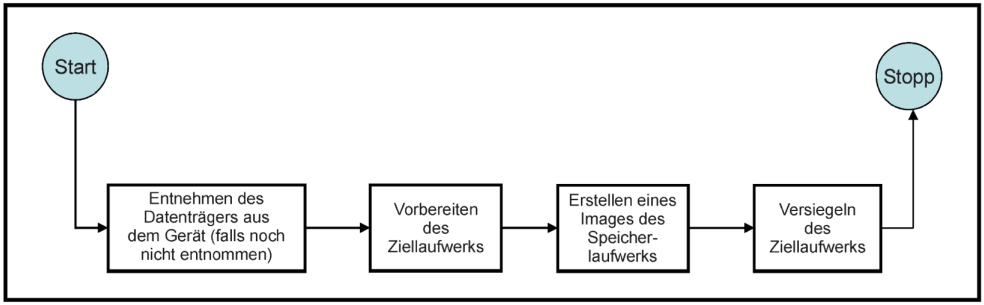

# LKF - Computerforensik

## Grundlagen und Beweisführung

### Forensik

<!--: PPT 1 - Folie 33 -->

> systematische Untersuchung von kriminellen Handlungen

### Digitale Forensik

- **streng methodisch vorgenommene Datenanalyse** (Datenträgern, Computernetzen)
- Ziel: **Aufklärung von Vorfällen**
- Verwendung von Möglichkeiten der strategischen Vorbereitung
  - insbesondere aus der Sicht des Anlagenbetreibers eines IT-Systems

### Ziele digitaler Forensik

<!-- PPT 1 - Folie 34  -->

- Identifikation des Angreifers
- Erkennen der Methode
- Ermittlung des Schadens
- Sicherung der Beweise

### Arbeitsgebiete digitaler Forensik

<!-- PPT 1 - Folie 35 -->

- **Datenträger**-Forensik
- **Mobilfunk**-Forensik
- **Netzwerk**-Forensik
- **Multimedia**-Forensik
- **Cloud**-Forensik
- **Memory**-Forensik
- **Car** Forensik
- **IoT**-Forensik
- Forensische **Linguistik**

#### Überschneidungen zu anderen Gebieten der Informationssicherheit

<!-- ToDo: HELP -> Findet ihr das relevant? -->

- Forensic Intelligence (predictive Policing, Untersuchung von Radikalisierung im Internet)
- Informationssicherheitsmanagement (ISM)
- Schadsoftware-Analyse / Reverse Engineering
- Untersuchungen im Darknet
- Kryptowährungen / Blockchain-Untersuchung

#### Multimedia-Forensik

- Feststellung von Spuren bzw. Manipulationen in Bildern/Videos/Audio
- Arbeitsgebiet der digitalen Forensik

### Herausforderungen der digitalen Forensik

- Massendaten in der Datenträger-Forensik: **Datenmengen immer größer**, Speicherplatz immer günstiger
- **Faktor Zeit:** bis zur Entdeckung eines Vorfalls vergehen oft Monate

### Dunkelfeld

> **Bereich der Cyber-Straftaten, die nicht in der polizeilichen Kriminalstatistik erfasst wird**, da sie nicht entdeckt werden.

#### Gründe für Nicht-Entdecken

- gute Angreifer (wird nicht entdeckt)
- mangelnde Schutzvorkehrung
- Firmen melden Vorfälle wegen Imageschäden/Zeitdruck nicht (schnell wieder einsatzfähig sein)
- Kein Interesse an forensischer Aufarbeitung

### Spuren

- materielle **Veränderungen an Personen oder Objekten**
- stehen **im Zusammenhang mit relevanten Ereignissen**
- **können zur Tataufklärung beitragen** (geben Rückschlüsse auf Tatablauf und Täter)

#### Digitale Spuren

- basieren auf Daten, welche in Computersystemen gespeichert sind bzw. übertragen wurden (Metadaten/Computerdaten $\rightarrow$ RAM, DBs, ...)
- werden erst durch ihre Interpretation von physischen Spuren über unterschiedliche Interpretationsebenen zu verwertbaren Spuren

#### Unterschiede im Gegensatz zu analogen Spuren

- digitale Spuren entstehen im Hintergrund
- können flüchtig sein, sind leicht änderbar
- können verschlüsselt sein
- liegen physisch auf Datenträger vor und müssen dann logisch interpretiert werden um lesbar zu werden

#### Spurenträger

<!-- ToDo: HELP PPT1 - Folie 45? -->

### Locard'sche Prinzip

> Es gibt keinen Tatort ohne Spuren!

- keine Person (Täter/Opfer/Ermittler) kann einen Tatort betreten und verlassen ohne Spuren zu hinterlassen
- Jeder der mit Tatort interagiert hinterlässt/verändert Spuren oder nimmt etwas mit.

> auch bei digitalen Spuren!

### Forensischer Arbeitsplatz

- **forensische Workstation** (sehr potente Hardware)
- **Office Computer** für schriftliche Sachen (Dokumentation) ohne Verbindung zum Netzwerk oder nur interne Verbindung, aber kein Internetzugang
- **Internetcomputer** für Recherche (aktuelle Virenscanner und Firewall!)

> $\rightarrow$ im Idealfall drei physische Rechner (forensische Workstation immer physisch getrennt)

### Forensic Readiness

> -**bereit sein** für forensische Prozesse durch forensischen Arbeitsplatz **(strategischer und operativer Ebene)**
> - Systeme sollen so konfiguriert sein, dass man digitale Spuren sammeln, schneller im Ernstfall agieren und Kosten sparen kann

- **Transportable Workstations** für Außeneinsätze (Beweismittel vor Ort erheben)
- **Schreibschutzadapter** für Datensicherung (Außen- und Laboreinsatz)
- **Technische Maßnahmen:** Gruppenrichtlinien konfigurieren (Server), Logging aktivieren
- **Organisatorische Maßnahmen:** Response-Teams, Hard- und Software beschaffen, Prozesse aufbauen (Verantwortliche, Budget, Kompetenzen, Räumlichkeiten, ...)

#### Schreibschutzadapter

- Gerät zwischen Datenträger und Auslesegerät
- verhindert dass Auslesegerät den Inhalt auf dem Datenträger verändern kann (blockiert Schreibzugriffe)

##### Datenintegrität

<!-- PPT1 - Folie 83 -->

> Verhindern/Feststellen von Datenveränderung durch Untersuchungen

- **Verhindern durch Writeblocks** (Schreibschutzadapter)
- **Feststellen durch Hashing** von forensischen Duplikaten (bereits während des Kopiervorgangs)

### Vorgehensmodelle

#### Anforderungen an forensische Vorgehensweisen

- **Akzeptanz:** Methoden sind in der Fachwelt anerkannt
- **Glaubwürdigkeit:** Funktionalität der Methoden ist nachweisbar
- **Wiederholbarkeit:** Ergebnisse ist durch Dritte reproduzierbar
- **Integrität:** Spuren werden durch Untersuchung nicht verändert
- **Ursache und Auswirkungen:** Verbindung zwischen digitalen Spuren, Ereignissen und Personen sindherstellbar
- **Dokumentation:** Ermittlungsprozess ist nachvollziehbar dokumentiert

#### BSI-IT-Forensik-Leitfaden

#### S-A-P-Modell

- **Secure:** strategische und operative Vorbereitungen zur Erfassung aller relevanten Daten durchführen
- **Analyse:** gesicherten Spuren und Beweise werden überprüfbar aufgearbeitet, sorgfältig geprüft und objektiv bewertet
- **Present:** Ermittlungsprozess wird nachvollziehbar dargelegt (präsentiert)

#### Post-mortem Forensik

- *"nach dem Tod"* werden nach einem Vorfall Daten erhoben und analysiert (z.B. Datenträger-Forensik)
- wenn Rechner ausgeschaltet und Festplatte ausbaubar $\rightarrow$ komplettes Datenträgerabbild mit forensischer Maschine erstellen
- komplette Datenträgerkopie erstellen, alles vollumfänglich gesichert
- können immer wieder neue Wege zur Ermittlung einschlagen durch die vollumfänglichen Kopien

#### Live Forensik

- *während das System noch läuft* findet die Untersuchung eines Vorfalls statt
- Daten live abziehen, wenn das System noch läuft (z.B. RAM)
- wenn kein physischer Zugriff/man weiß nicht was drauf läuft/evtl. Verschlüsselung bei herunterfahren
- Vorteil: geht deutlich schneller

#### logische Sicherung

- auf Betriebssystemebene
- mit Mitteln des Betriebssystems
- mit Drittanwendersoftware
- erfolgt abhängig von Betriebssystem

#### physikalische Sicherung

- auf Hardwareebene
- mit hardware- und softwaretechnischen Hilfsmitteln
- erfolgt betriebssystemunabhängig

## ISO 27037 und Tatorfotografie

### Beteiligte Akteuere in der ISO 27037

<!-- ToDo: Auf Duplikat prüfen-->

- **Ersteinschreiter für digitale Beweismittel (DEFR):** Befugt ist die ersten Maßnahmen am Tatort/an den Systemen vorzunehmen, der über Sicherungsmethode entscheidet & über Methode der Mitnahme
- **Spezialist für digitale Beweismittel (DES):** kümmert sich um Analyse, kann Aufgaben des DEFR übernehmen, aber zusätzlich noch Analysen

### Allgemeine Schritte nach ISO 27037

- Sichern und Kontrollieren des Bereichs, in dem sich die Geräte befinden
- Bestimmung der Person, die für den Ort die fachliche Verantwortung trägt
- Sicherstellen, dass Personen von den Geräten und von der Stromversorgung ferngehalten werden
- Alle Personen dokumentieren, die Zugang zum Ort haben oder für die ein Motiv für eine Beteiligung am Untersuchungsort vorliegen könnte
- Ist das Gerät eingeschaltet, darf das Gerät nicht ausgeschaltet werden und umgekehrt, falls das Gerät ausgeschaltet ist, darf es nicht eingeschaltet werden
- Untersuchungsort mit allen Komponenten und Kabeln in seiner ursprünglichen Position dokumentieren
- Falls zulässig: Bereiche nach Gegenstände, wie Haftnotizen, Terminkalender, Akten, Laptops oder Handbücher für Hard- und Software durchsuchen

### Grundsätzliche Regeln am Tatort

- ruhig und überlegt vorgehen
- **grundsätzlich nichts anfassen, verändern, verlegen etc.**
- **unklare Lage $\rightarrow$ weiträumige Sicherung**
- Einsatzfahrzeuge nicht an unmittelbaren Tatort bringen
- nur Ausrüstung/persönliche Dinge an den Tatort bringen, die benötigt werden
- keine Einrichtungen am Tatort nutzen
- nicht essen, trinken, rauchen!
- Kontaminationen vermeiden
- keine eigenen Spuren hinterlassen
- erforderliche Veränderungen markieren und **dokumentieren**

### Durchführung einer Risikobeurteilung

- Welche **Art von Mitnahme-/Sicherungsmethode** wird angewendet?
- Welche **Ausrüstung** wird möglicherweise vor Ort benötigt?
- Inwieweit sind die Daten und Informationen im Hinblick auf die **potentiellen digitalen Beweismittel flüchtig**?
- Ist ein Fernzugriff auf irgendein digitales Gerät möglich und stellt er eine **Bedrohung für die Beweismittel-Integrität** dar?
- Was passiert, wenn der Datenbestand beschädigt ist?
- Könnte der Datenbestand beeinträchtigt worden sein?
- Könnte das digitale Gerät so konfiguriert worden sein, dass Daten zerstört (bspw. eine sog. Logikbombe), vereitelt oder verschleiert werden, wenn das Gerät ausgeschaltet wird oder ein unkontrollierter Zugriff darauf erfolgt?

### Grundsätze der digitalen Beweisführung

Relevanz, Vollständigkeit, Verlässlichkeit

- alle Maßnahmen dokumentieren
- Methoden anwenden, mit welchen die Fehlerfreiheit und Verlässlichkeit der Kopie von potentiellen digitalen Beweismitteln festgestellt werden kann
- Erkennen, dass der Vorgang der Erhaltung von potentiellen digitalen Beweismitteln nicht immer eingriffsfrei erfolgen kann

### Identifikationsphase

- nach ISO: Ersteinschreiter wird tätig und sucht nach Beweismitteln, diese können in physischer und logischer Form vorliegen
- physisch: Vorhandensein auf konkreten Gerät, die Zustände der einzelnen Datenträgern auf Bitebene
- logisch: physische Form interpretieren z.B. Mithilfe Betriebssystem oder Dirttanwendersoftware
- logische Form soll dargestellt und gesichert werden
- soll Speichermedien und alle datenverarbeitenden Geräte identifizieren (die Vorfall-relevant sein können)
- Priorisierung der Beweismittelerhebung auf Grundlage der Flüchtigkeit der Daten
- Ein- oder ausgeschalteter Zustand der Geräte

### Leitfäden nach ISO 27037

#### Mitnahme von eingeschaltenen digitalen Geräten

#### Mitnahme von ausgeschalteten digitalen Geräten

#### Sicherung von eingeschalteten digitalen Geräten

#### Sicherung von ausgeschalteten digitalen Geräten

### Mitnahme vs. Sicherung

> Entscheiden, ob man das Gerät an sich braucht oder nur Daten auf der Festplatte
>
> Wichtiges Entscheidungskriterium: ist das Gerät aus oder an? Wenn es an ist $\rightarrow$ Live Forensik vor Ort mögl. oder mit Stromzufuhr Mitnahme oder Sicherung vor Ort vornehmen (gerade bei schweren Geräten, die man erst ausschalten müssen oder so, bei systemkritischer Technik)

### Totmannschaltung

- Mechanismus, der ausgelöst wird wenn die Bestätigung durch einen Menschen ausbleibt
- im digital forensischen Umfeld Manipulationen am Tatort: ausschalten/abziehen eines Geräts, entfernen eines Tokens (z.B. abziehen eines USB-Sticks) kann zur Verschlüsselung des Systems führen

### Grundlegende Maßnahmen für ausgeschaltete digitale Geräte

- **Zustand prüfen:** Gerät WIRKLICH ausgeschaltet? (Status-LEDs, Maus bewegen, ...)
  - besonders bei Laptops! anschließend Akku entfernen
- **Stromzufuhr trennen:** zunächst am Gerät (damit keine unterbrechungsfreie Stromzufuhr ausgelöst wird)
- **Alle Kabel trennen, sichern und kennzeichnen** die mit dem Gerät verbunden sind
  - Beim Entfernen von Komponenten auf Erdung achten
- **Dokumentieren**, ob CD/DVD-Laufwerke leer und vollständig eingefahren sind
- **Transport-Sicherung:** Beschädigungen des Gerätes vermeiden $\rightarrow$ Anti-Statik Beutel, ...
  - Ein-/Aus-Knopf überkleben $\rightarrow$ Zustandsänderung verhindern

> In den meisten Fällen sollte das Speichermedium bis zum Zeitpunkt der Sicherung nicht aus dem digitalen Gerät entfernt werden, da das Entfernen das Risiko der Beschädigung oder Störung durch andere Speichermedien erhöhen kann.

### Grundlegende Maßnahmen für eingeschaltete digitale Geräte

- Sicherung der flüchtigen Daten in Betracht ziehen
  - Verschlüsselungscodes können im aktiven und inaktiven Speicher vorhanden sein
  - Wenn Verschlüsselung vermutet wird, dann logischer Sicherung in Betracht ziehen
  - Analyse, ob das Gerät durch normales Herunterfahren ausgeschalten werden sollte oder mittels Netzstecker
  - Beim Trennen des Netzsteckers darauf achten, dass die Seite am Gerät zuerst getrennt wird und nicht auf Seiten der Steckdose
- Netzschalter mit Klebeband abkleben!

> Beim Trennen der Stromzufuhr werden verschlüsselte Daten ohne passenden Schlüssel unzugänglich gemacht. Live-Daten können verloren gehen, was zu Schadensersatzansprüchen oder zu Verlusten von Menschenleben führen kann!

### Erhebung von nicht digitalen Beweismitteln

- digitaler Ersteinschreiter sollte nicht nur digitale Beweismittel erhalten, sondern auch nicht digitale Beweismittel berücksichtigen
- z.B. Personen, die für das Büro vor Ort verantwortlich sind, Zugänge von diesen Personen herausgeben lassen
- diese Personen können zusätzliche Infos für Doku herausgeben $\rightarrow$ relevante Details aus Gesprächen mit aufnehmen, Name und Position der Person dokumentieren
- Hinweise die z.B. Passwort herausgeben (Post It Zettel), andere weitere Notizen

### Besonderheiten bei der Sicherung digitaler Beweismittel

Spuren entstehen im Hintergrund, können **flüchtig** sein, sind **leicht änderbar**, können **verschlüsselt** sein, liegen physisch auf Datenträger vor und **müssen logisch interpretiert** werden um lesbar zu werden

### Hashwerte

> Mathematische Funktion, die beliebig lange Zeichenfolgen auf Zeichenfolge fester Länge abbildet (schnell, deterministisch)

- **Datenintegritätsprüfung** (Datensicherung, Passwörtern)
- **Dateninhaltsvergleiche** Kinderporngrafie, UrhG-geschützte Werke finde finden / generische Systemdateien für Untersuchung ausblenden

## Bekämpfung der Computerkriminalität

### CERT

- **C**omputer **E**mergency **R**esponse **T**eam
- Kontaktstellen bei größeren IT-Sicherheitsvorfall
- für Bundesbehörden auf Landesebene (pro Bundesland)
- auch bei größeren Unternehmen (extern ausgelagert)

### Die sechs Schritte des SANS-Institut

- **1. Vorbereitung:** Organisation und Mitarbeiter sensibilisieren und trainieren $\rightarrow$ schnelle und korrekte Reaktion auf Computer- und Netzwerk-Sicherheits-Zwischenfälle
- **2. Identifizierung:** Entscheidung des Response Teams, ob ein bestimmtes Ereignis eine Bedrohung darstellt
  - Team kann sich an das CERT CoordinationCenter wenden (aktuelle Infos zu Sicherheitsvorfällen, ...)
- **3. Eingrenzung:** Bestimmung des Schadensumfanges durch das Team $\rightarrow$ welcher Schaden; nimmt alle betroffenen Systeme/Geräte zur Verhinderung weiterer Schäden offline
- **4. Beseitigung:** Untersuchung der Herkunft des Vorfalls und Beseitigung der Ursache des Problems durch das Team.
- **5. Recovery:** Wiederherstellung von Daten und Software von Backup-Systemen; Überprüfung der Schließung der Sicherheitslücken; Überwachung der Systeme für Anzeichen von Kompromittierung/erneutes Auftreten
- **6. Nachbesprechung:** Team untersucht den Vorfall und wie er behandelt wurde und versucht die Vorfallbehandlung und Prävention zu verbessern, um ein erneutes Auftreten des Problems zu verhindern

### BSI IT-Grundschutz Kompendium

- Katalog für die einzelnen Bereiche einer Organisation einzelne Bausteine beschrieben
- Applikation, System, Organisation usw.

## Betriebssysteme

### Stand der Technik

- Rechtsformulierung da sich Gesetze langsamer als die Technik entwickeln
- Hinweise auf Stand der Technik geben bspw. IT-Grundschutz Bausteine

### Aufbau eines E-Mail-Headers

- Folgende Angaben kann der Angreifer manipulieren
  - `From` (Absender)
  - `To` (Empfänger)
  - `Date` (Zeitpunkt der Erstellung)
  - `Subject` (Betreff)
  - `Message-ID` (eindeutige Zeichenfolge)
- praktisch manipulationssicher: `Received` (Weg der Email vom Sender zum Empfänger)
- Header und Inhalt wird durch eine Leerzeile getrennt

<!-- ToDo: Können wir das folgende entfernen? -> good to know: G Suite Toolbox Nachrichten-Header-->

#### Received-Einträge im E-Mail Header

- jeder Mailrouter fügt dem Header seine Kennung hinzu, wenn er die Mail verarbeitet
- Anomalien leicht feststellbar
- Phishingmails darüber identifizieren

### Wichtige Fundstellen von Beweisen

#### Windows Registry

- Konfigurationsdatenbank des Betriebsystems
- Einstellungen von Systemdiensten und -prozessen sowie von anderen Anwendungen
  - werden als Key/Value-Pairs gespeichert und in `Registry Hives` aufgeteilt
  - verschiedene Datenbanken (`Registry Hives`) liegen als Datei auf dem Datenträger vor

> `C:\Windows\System32\Config\`, `C:\Windows\Users\${Name}`

#### Volume Shadow Copy (Windows)

- Snapshots eines `NTFS` Volumes (pro `NTFS` Volume 64 Snapshotkopien)
- arbeitet auf `copy` und `write` Basis
- alte Zustände eines Volumes abrufen
- aller 7 Tage, bei Patches, Treibersoftware etc. erstellt

#### Alternate DataStream

- `Data`-Attribut mit `DataRuns` mit Clusternummern mit eigentlichen Dateininhalten
- zusätzlich `Alternate DataStreams` anhängen mit weiteren Infos zur Datei
  - z.B. lokaler Ursprung der Datei bzw. aus Internet
- man kann darin Dateien verstecken (z.B. Schadsoftware)

#### Windows SID

- `SID` wird pro Benutzergruppe/Benutzerkonto **eindeutig** vergeben

> $\rightarrow$ nachvollziehen, wer was geändert hat

- Benutzerrechte damit zuweisen
- welcher Nutzer hat Zugriff, wer hat es angelegt und wer hat es geändert
- ob Nutzer gelöscht wurden, die daran etwas gemacht haben
- Log-Dateien bzgl. Löschvorgangs/Änderung an Nutzerkonten
- `SID` bleibt immer identisch

#### Wichtige Fundstellen unter MacOS

<!-- ToDo: passt das oder eher PPT3 - Folie 48? -->

> Aufteilung nach Systemdaten (`/System/Library/`, `/Library/`), Benutzerdaten und
Softwaredaten (`/Application`)

<!--ToDo: Was könnte noch zu MacOS gefragt werden?-->

#### Plist-Dateien (MacOS)

- Property List Dateien: Key-Value-Paare
- vorallem unter macOS vorhanden, als Konfigurationsdateien
- vom Aufbau `XML`-Dateien mit spezifischen Schlüsselpaaren
  - welche Konfigurationsparameter, wurden wann und von wem zuletzt geändert

### Interessante Linux-Anwendungsprotokolle

- `apache2`
- `httpd`
- `samba`
- `mysqld`

## Techniken der Spurensuche und RAM Analyse

### Dateitypüberprüfung

- Dateien ohne Dateiendung analysieren & Dateityp identifiziert
- durch Header & Footer Informationen

#### Magic-Bytes

- spezieller Wert, der ein bestimmtes Dateiformat am Dateibeginn kennzeichnet
- z.B. `0xFFD8FF` für `JPEG`

### FileCarving

- Suche nach Dateien, die gelöscht wurden
- nicht mehr im allokierten Speicher, aber noch drauf sind
- z.B. mit Hex-Editor

### RAM Sicherung Sicherungstechniken

- User-Level vs. Kernel-Level vs. Crash-Dump
- Bus-based (extern) vs harware-based (intern)
- Cold-Boot mit oder ohne RAM Transfer
- Hibernation-based vs Virtualisation-based

### User-Level vs Kernel-Level RAM Sicherung

User Level

- Sicherung der Bereiche, auf die der Benutzer selbst Zugriff = die Anwendungen die mit seinen Rechten gestartet wurden.
- Malware-Prozesse können versteckt und nicht auffindbar sein (Rootkit Hiding Technologien / APT).
- Tools: Sysinternals ProcDump (CMD basiert) oder der Process Explorer (Abbildung) oder Taskmanager

Kernel Level

- durch Nutzung des Kernels des Betriebssystems (Ring 0) werden die kompletten Hauptspeicher-Bereiche gesichert
- Kernel Mode Treiber und Admin/Root Passwort nötig
- Veränderung des RAM durch Sicherungsanwendung selbst
- Vorteil zu User Level: gesamter `RAM` gesichert und nicht selektive Sicherung
- Tools: DumpIt/Comae; LiME; Rekall Memory Toolkit: memsic

### Cold Boot

- `RAM` Sicherungsmethode
- `RAM` heruntergekühlt um kurzzeitig Stromzufuhr zu unterbrechen + keine Inhalte verlieren
- mit/ohne Transfer, ohne/mit Livesystem

### Volatility Framework

- Framework zum Analysieren von `RAM`-Abbildern

### Hinweise auf einen Einbruch

- wenn Rechner auffällig langsam wird
- verdächtige/unbekannte Prozesse im Taskmanager prüfen
- Auffälligkeiten bei Netzwerkverbindungen
- Auffälligkeiten in Log-Dateien (unvollständig/geleert)
- unbekannte Benutzer, besonders Admin Accounts
- Meldungen von Antiviren-Software, Protokolldateien der Software prüfen

## Dateisysteme

### Sektoren

- Zusammenfassung **einzelner Bytes** zu einem Block
- auf Ebene der **Festplattenfirmware** festgelegt (z.B. 512 Bytes)

### Cluster

- Zusammenfassung **einzelner Sektoren** zu einem Block
- auf Ebene der **Betriebssysteme** realisiert (abhängig von Dateisystem)

> **Betriebssystem arbeitet nur clusterweise** $\rightarrow$ es werden immer ganze Cluster gespeichert

### Aufbau FAT-Dateisystem

<!-- Folie 5-15 (done) und Folie 5-21 (TODO) -->

> `FAT` = **F**ile**A**llocation**T**able + DirectoryEntries

- Partition:
  - Bootsektor + Partitionskennung
  - Reservierte Sektoren
  - `FAT` Bereich
  - Datenbereich mit Verzeichniseinträgen

Ein Eintrag in der `FAT` ordnet Clusternummer zu:

- Unbenutzer Cluster
- Nummer Folgecluster (gleiche Datei)
- reservierter Cluster
- defekter Cluster
- EOF

Dateien, die sich über mehrere Cluster erstrecken, sind durch das die Verweise der Folgecluster bis EOF auffindbar.

#### ROOT-verzeichnis bei FAT

- im Datenbereich des `FAT`-Datenträgers
- `FAT12`, `FAT16` $\rightarrow$ direkt im Anschluss an die `FAT`
- `FAT32` $\rightarrow$ kann überall beginnen, meist in den Sektoren direkt nach der `FAT`
- Root Verzeichnis finden: boot Sektor ansehen, wie viele reservierte Sektoren, zwei im Offset und ein paar mehr $\rightarrow$ dann diese Zahl ist das gesuchte ROOT-Datenverzeichnis

#### Löschung und Wiederherstellung von Daten im FAT Dateisystem

<!-- ToDo -->

### Master Boot Record (MBR) - Partitionierung

<!-- PPT5 - 6/7 -->

- MBR (Bootsektor) befindet sich am Anfang des Datenträgers
- enthält u.a. Boot Loader, Partitionstabelle (64 Bytes)
- Einträge Partitionstabelle sind 16 Bytes groß
  - Erster/Letzter Sektor, Partitionstyp, Anzahl Sektoren ...
- mit MBR-Partitionierung **max. 4 Partitionen**

### GUID Partition Table (GPT) - Partitionierung

- GPT (Bootsektor) befindet sich am Anfang des Datenträgers
- **Aufbau GPT**:
  - LBA Block 00: Protective MBR
  - LBA Block 01: GPT HEADER
  - LBA Block 02 bis 33:
    - Partitionseinträge / 4 je Block
    - Blockgröße 512 Byte - Partitionseintrag 128 Byte
  - LBA Block 34 ff. bis -34: Partition 1 bis 128
  - LBA Block -33 bis -1: Blöcke 1 bis 34 erneut am Ende des Datenträgers
- mit GPT-Partitionierung **max. 128 Partitionen** (bis zu 8192 Exabyte)
- **Inhalt GPT-Partitionseintrag**:
  - Typ, GUID Partition, Beginn, Ende, Attribute, Name

### NTFS

#### Master File Table

<!-- ToDo: Prüfen: wichtigsten Attribute vorhanden -->

- Teil des `NTFS` Dateisystem
- Datei auf dem Datenträger die Infos über alle anderen Dateien & Verzeichnisse enthält
- enthält verschiedene Informationen über Aufbau des Datenträgers
- Datenbank mit Adressen zu jeder Datei auf den Datenträger, jede Datei besitzt MFT Eintrag mit verschiedenen Attributen
- wichtigste Attribute: Filename, Standard-Attribut (Meta-Daten, wann wurde es angelegt etc.), Data-Attribut (enthält Daten direkt (wenn klein genug, `MFT` Eintrag ist meist 1024 Bytes groß), sonst `DataRuns`)
- Datei (vgl. Datenbank) mit Einträgen zu allen Dateien/Verzeichnissen
- **Attribute: Filename, Metadaten, Data (Daten selbst oder `DataRuns`)**

#### $DATA Attribut

- Attribut im `NTFS`-Dateisystem
- die tatsächlichen Daten, die in die Datei geschrieben wurden
- direkte Daten oder `DataRuns`

#### Löschung und Wiederherstellung von Daten im NTFS Dateisystem

<!-- ToDo -->

### Slackspeicher

- Ursprung: interne Fragmentierung
- Cluster wird nicht komplett durch eine Datei ausgenutzt, ist aber komplett ausgefüllt $\rightarrow$ **verbleibender Bereich = Slackspeicher**
- Slackspeicher kann alte Daten beinhalten
- z.B. bei `FAT` oder `NTFS`, aber **nicht bei `ext`**

### MAC-Zeitstempel

- jedes Betriebssystem besitzt Zeitstempel
- `Modification`, `Access`, `Change`/`Creation`-Time

### Superblock

> alle wichtigen Infos zum `ext`-Dateisystem

- Adresse des ersten Blocks
- Blockgröße
- Blockgruppengröße
- Anzahl freier Inodes
- ...

### Aufbau ext3 / ext4-Dateisystem

Inhalt einer Partition:

- Boot Block
- Block Gruppe 0
  - Superblock
    - Anzahl freie Blöcke, Anzahl freie Inodes, Blockgröße etc.
  - Gruppen Descriptor
  - Block Bitmap
  - Inode Bitmap
  - Inode Tabelle
  - Dateninhalte
- Block Gruppe 1... n

<!-- TODO: Begriff "Blockgruppen" muss erläutert werden-->

<!-- PPT 05 - Folie 42 done, 47 todo muss mit rein -->

### Umgang mit Dateien im Ext-Dateisystem

- Superblock & Gruppendeskriptortabelle (wie viele freie Blöcke pro Block, weitere Infos zu Inodes z.B. Inode mit 2 ist immer Rootverzeichnis)

### DataRuns

- bestehen aus einer Anzahl an Clustern, besitzen Clusternummern die dazugehören
- über diese Clusternummern lässt sich Datei zusammenbauen
- Liste von Clustern
